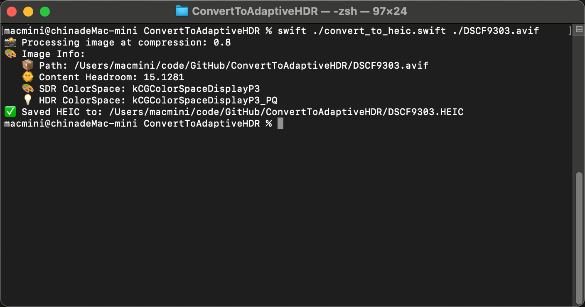
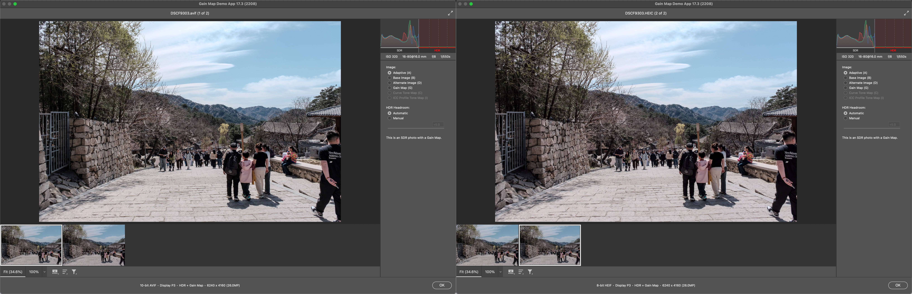
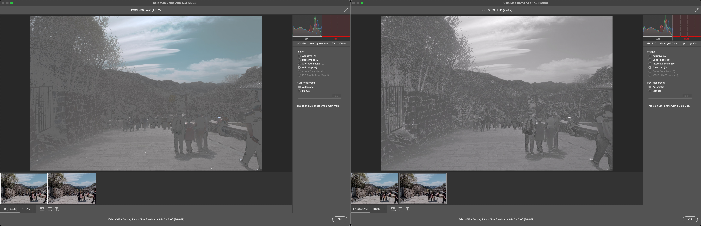

# ConvertToAdaptiveHDR
This tool converts HDR images to Apple's Adaptive HDR format (SDR photo with a Gain Map).

## Environment
Last tested on macOS 15.3.2 (24D81)

## Usage
```
Usage: convert_to_heic.swift <file_path> [compression_ratio]
```

## Example
```
swift ./convert_to_heic.swift ./DSCF9303.avif
```

## Screenshots








Note that the color Gain Map generated by Lightroom is converted into a grayscale Gain Map.

## References
* https://juniperphoton.substack.com/p/process-apple-gain-map-the-imageio
* https://developer.apple.com/cn/videos/play/wwdc2024/10177